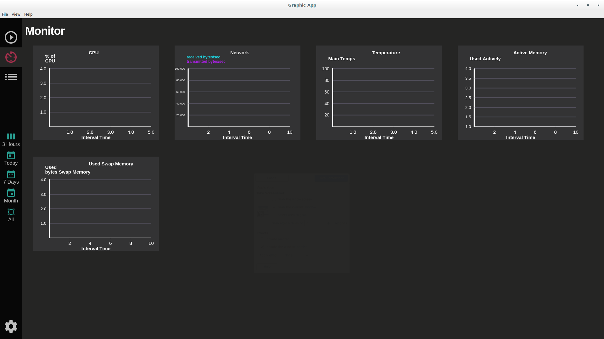
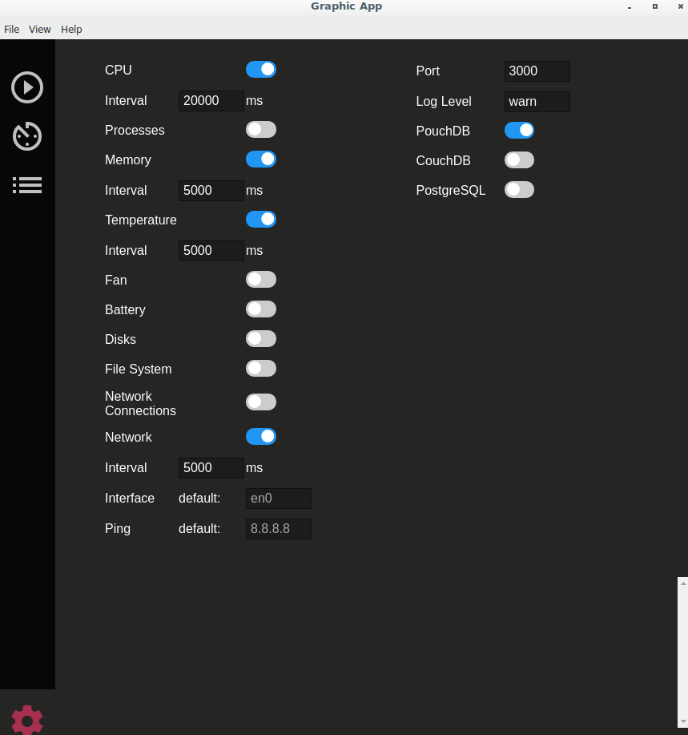
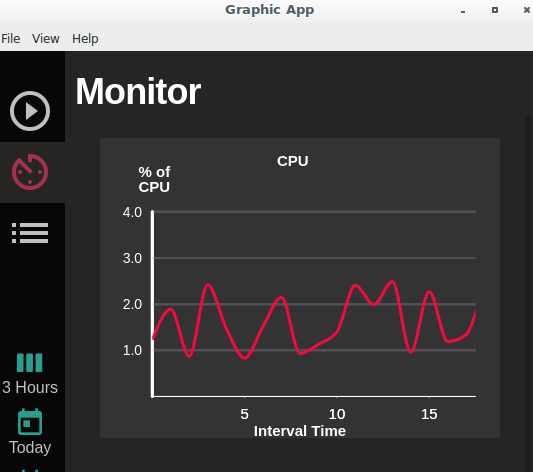
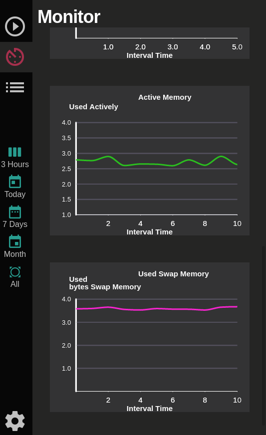
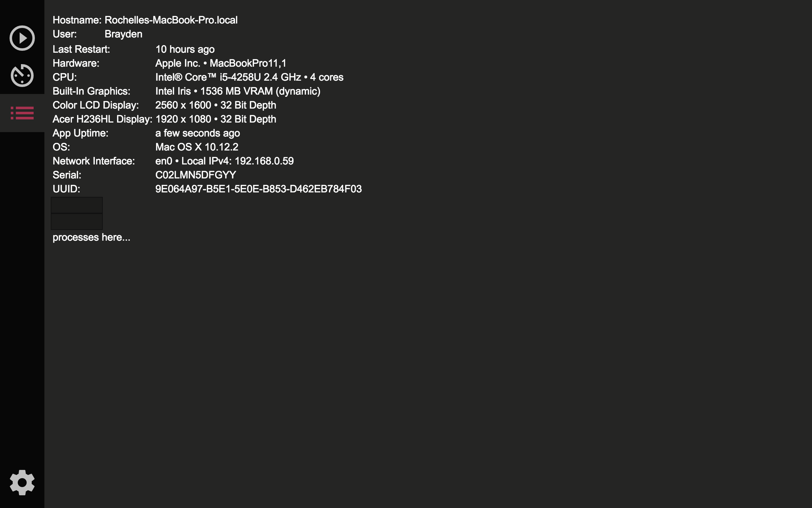

# Graphic
Inspired by [Grafana](http://play.grafana.org/), we have set out to improve visualizations for system information on MacOS and Linux. However, our app is ready to view CPU data out of the box, without having to connect an external database or collector like Collectd. Implementing our knowledge of Electron, Node and React, we have created an open source application to view computer metrics in an easy to view and customizable app, Graphic.

Many advanced CPU dashboards either require advanced software knowledge to implement Grafana with Collectd and a database, or the InfluxData software stack, or they're too simple and only display simple realtime data. We wanted to view our over data time and watch progression with various CPU, memory and network metrics which especially interest us as developers. Graphic solves this need producing a full stack desktop app.

### Development Status
This project is currently in progress.

## Features Guide

Here we have our main view which is the monitor page. This page displays any graphs that have been activated in the settings so that they are ready to display their respective data.

Here on the settings page you can toggle which graphs you want to view on the monitor page. You can also change the data retrieval interval, which port you want to use, and a few other useful options.

Once the settings have been saved and graphs have been toggled on, you can navigate back to the monitor view and use the buttons on the left side to choose a period of time for data to display. The above image shows an example of 3 hours of CPU data.

This is an example of 3 hours of memory data.

Lastly, this is the info view which displays all sorts of useful tidbits of information for the users machine.

## Installation
`NPM install` the dependencies. Then, `NPM start` to start the Electron app.

## To Do
- VictoryJS graphic implementation
- Frontend in React

## Developed By
- [Sid](https://github.com/matthewsidneyjacobs)
- [Brett](https://github.com/brettinternet)
- [Jason](https://github.com/JasonMarkWomack)
- [Brayden](https://github.com/Kymbolde)

## Credits
- [systeminformation](https://github.com/sebhildebrandt/systeminformation)
- [Node-SMC](https://github.com/mmarcon/node-smc)
- [Public IP](https://github.com/sindresorhus/public-ip)
- [Electron + React help](https://github.com/chentsulin/electron-react-boilerplate)
